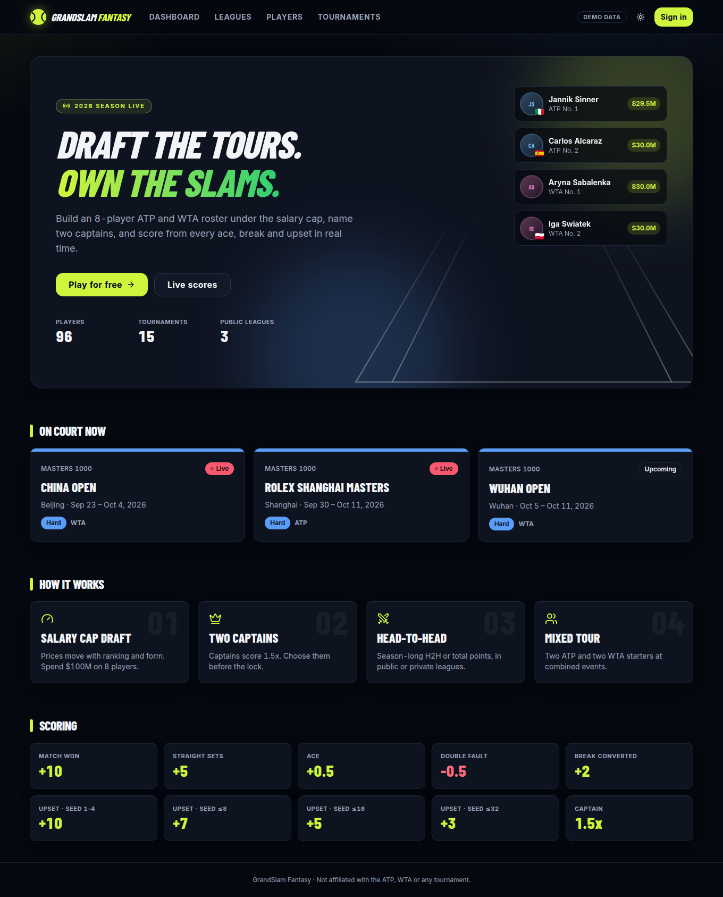
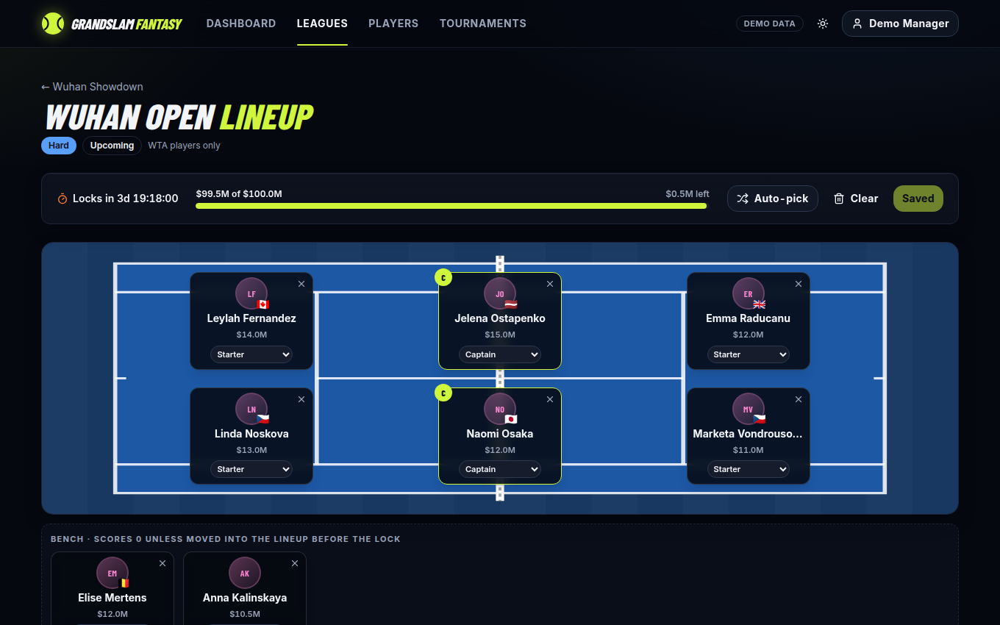
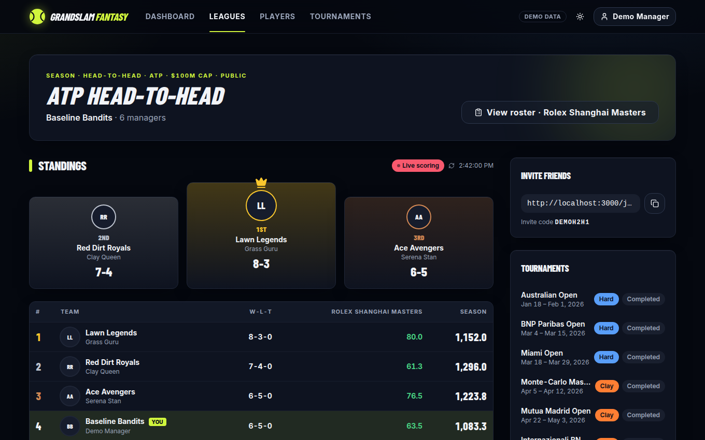
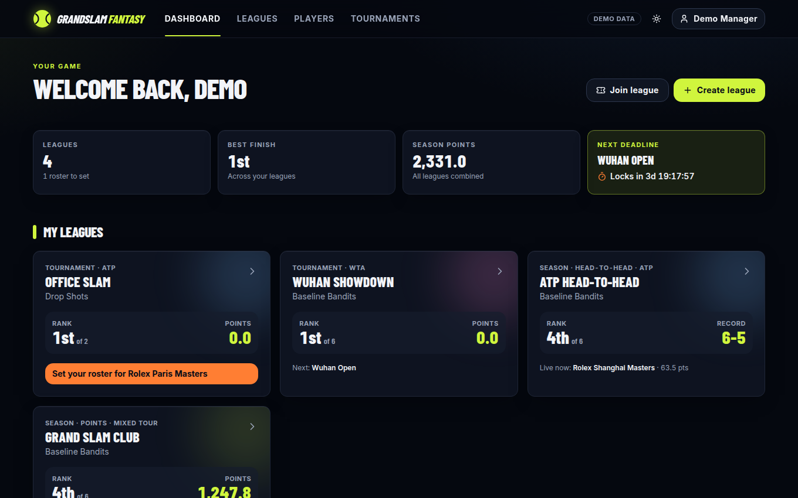
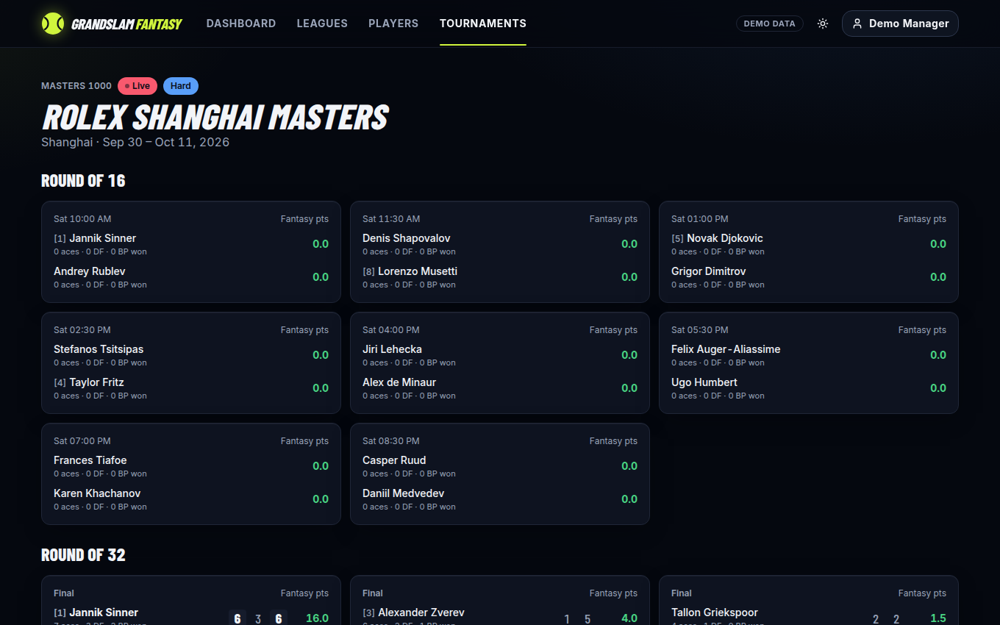
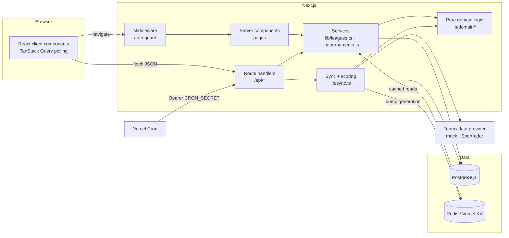
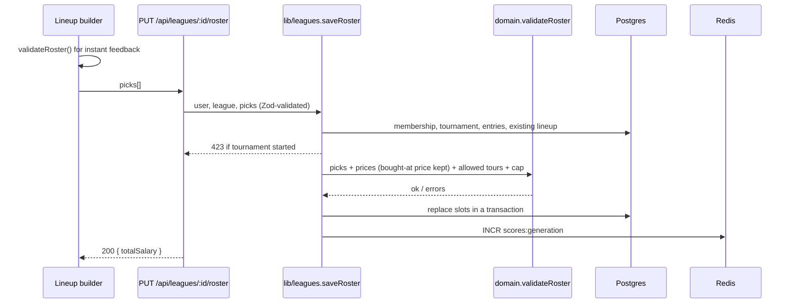
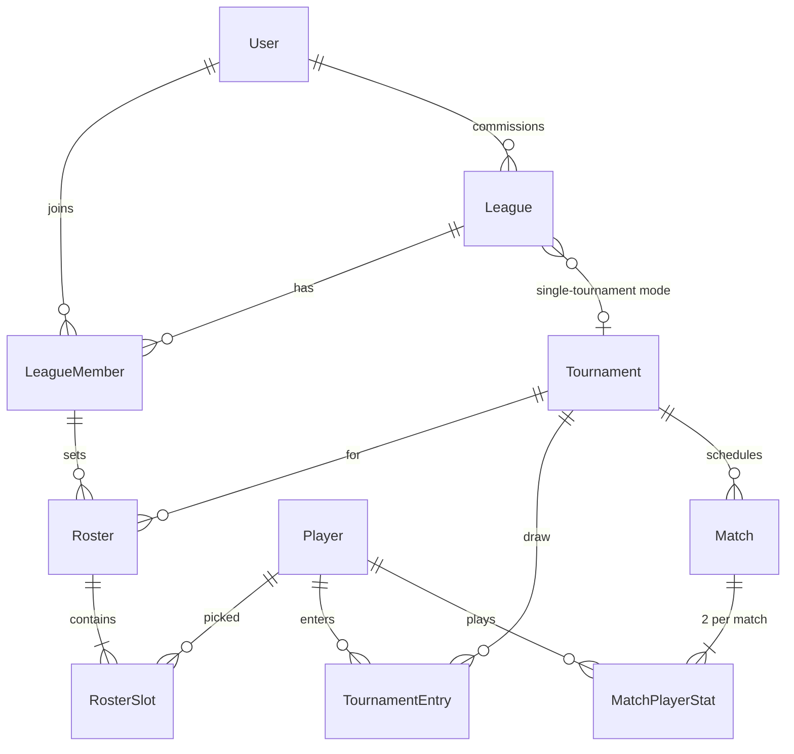
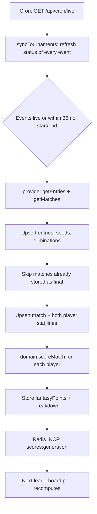

# GrandSlam Fantasy

Fantasy tennis for the ATP and WTA tours. Create leagues with friends, draft real players under a salary cap, set an 8-player lineup for every Grand Slam and Masters 1000, and follow standings that update live as matches are played.



---

## Contents

- [The game](#the-game)
- [Screens](#screens)
- [Tech stack](#tech-stack)
- [Architecture](#architecture)
- [Data model](#data-model)
- [Scoring pipeline](#scoring-pipeline)
- [Tennis data providers](#tennis-data-providers)
- [Getting started](#getting-started)
- [Configuration](#configuration)
- [Testing and quality](#testing-and-quality)
- [Design system](#design-system)
- [Deploying](#deploying)
- [Project layout](#project-layout)
- [Roadmap](#roadmap)

---

## The game

### Leagues

| Option | Choices |
| --- | --- |
| Tour | **ATP**, **WTA** or **Mixed** (both tours in one lineup) |
| Mode | **Single tournament** (one Grand Slam or Masters 1000) or **Season-long** (every eligible event in the calendar year) |
| Season format | **Points** (highest season total wins) or **Head-to-head** (round-robin; one matchup per tournament, best W-L record wins) |
| Access | **Public** (listed on the Leagues page) or **Private** (invite link `/join/CODE` or code), each with an optional passcode |
| Settings | Salary cap ($60M–$200M, default $100M) and maximum managers (2–50) |

### Lineups

Every manager picks **8 players per tournament**:

| Slot | Count | Multiplier |
| --- | --- | --- |
| Captain | 2 | 1.5x |
| Starter | 4 | 1x |
| Bench | 2 | 0x, unless moved into the lineup before the lock |

- **Salary cap.** Each player has a price from $4M to $30M, driven by world ranking and the last 10 results (`src/lib/domain/salary.ts`). A player keeps the price they were bought at, so price swings never break a saved lineup.
- **Mixed rosters.** At combined events (Slams and joint Masters) a mixed lineup starts 2 ATP and 2 WTA players and names one captain from each tour. At a single-tour event (Shanghai, Beijing) a mixed league plays that tour only.
- **Lockout.** Transfers and captain changes freeze at the tournament's start time. The server rejects late edits with `423 Locked`; the lineup screen shows a live countdown.
- **Carry-over.** In season leagues the previous lineup is carried forward for players who are in the next draw, so managers only need to tweak it.

### Scoring

| Event | Points |
| --- | --- |
| Match won | +10 |
| Straight-sets win | +5 bonus |
| Ace | +0.5 |
| Double fault | −0.5 |
| Break point converted | +2 |
| Beat a top-4 seed | +10 upset bonus |
| Beat a 5–8 seed | +7 |
| Beat a 9–16 seed | +5 |
| Beat a 17–32 seed | +3 |

Running stats (aces, double faults, breaks) score while a match is in progress so leaderboards move live. Win, straight-sets and upset bonuses land when the match ends. Retirements and walkovers count as wins but never earn the straight-sets bonus.

---

## Screens

<table>
  <tr>
    <td width="50%" align="center"><b>Lineup builder on the court</b><br></td>
    <td width="50%" align="center"><b>Live head-to-head league</b><br></td>
  </tr>
  <tr>
    <td width="50%" align="center"><b>Dashboard</b><br></td>
    <td width="50%" align="center"><b>Live scores</b><br></td>
  </tr>
</table>

- **Landing**: hero, live tournaments, how it works, scoring.
- **Dashboard**: stat tiles, next lineup deadline with countdown, league cards with rank and points, live and upcoming events.
- **League**: podium for the top three, live standings (polled every 15s while a tournament is live), head-to-head matchups, invite link, tournament list with lineup status.
- **Lineup builder**: a to-scale tennis court in the tournament's surface colour with captains at the net and starters in the service boxes, bench strip, salary bar, auto-pick, and a sortable player pool (rank, salary, surface win %, points).
- **Players**: ATP / WTA / Mixed toggle, search, sort by rank, salary, season wins or surface win %.
- **Tournaments**: calendar grouped by live, upcoming and completed; each event has round-by-round scorecards with stats and fantasy points.

---

## Tech stack

| Concern | Choice |
| --- | --- |
| Framework | Next.js 15 (App Router, React Server Components, Route Handlers, Middleware), React 19, TypeScript (strict) |
| Styling | Tailwind CSS 3, shadcn-style components on Radix primitives, Lucide icons, `next-themes` |
| Database | PostgreSQL with Prisma ORM 6 |
| Auth | NextAuth.js 4: GitHub, Google, email magic link, optional demo sign-in; JWT sessions |
| Client data | TanStack Query 5 (polling, mutations) |
| Cache | Redis or Vercel KV through `ioredis`; in-memory fallback |
| Validation | Zod |
| Tests | Vitest |
| Jobs | Vercel Cron hitting authenticated route handlers |
| CI | GitHub Actions: lint, typecheck, tests, build |

---

## Architecture



The code is split into four layers, each depending only on the ones below it:

1. **Domain** (`src/lib/domain`). Pure TypeScript with no I/O: scoring, salaries, roster validation, auto-pick, lockout, round-robin scheduling and standings. Everything here is unit-tested and shared by the server and the browser (the lineup builder validates with the same function the API uses).
2. **Providers** (`src/lib/tennis`). The `TennisDataProvider` interface and its implementations. Nothing outside `lib/sync.ts` talks to a provider.
3. **Services** (`src/lib/sync.ts`, `src/lib/leagues.ts`, `src/lib/tournaments.ts`). Database access, caching and business rules that need data (membership checks, lock enforcement, leaderboard assembly).
4. **Delivery** (`src/app`). Server components render pages directly from services. Route handlers expose the same services as JSON for client components and cron. `lib/api.ts` maps `ServiceError` and Zod errors to HTTP responses.

### Request flows

**Saving a lineup**



**Live scoring** runs every minute (see [Scoring pipeline](#scoring-pipeline)). Browsers on a league page poll `GET /api/leagues/:id/leaderboard` every 15 seconds while a tournament is live and every 2 minutes otherwise.

### Caching

Leaderboards and tournament scorecards are cached under keys suffixed with a global **generation** number (`scores:generation`). Anything that changes scores or lineups (a score poll, a lineup save, a new member) increments it, which invalidates every derived view at once without tracking individual keys. Entries also carry a short TTL (15–20s). If Redis is down, reads fall through to Postgres.

### Auth

NextAuth runs with the Prisma adapter and JWT sessions, so OAuth, magic-link and the demo credentials provider share one session model. Providers switch on only when their environment variables are present. `src/middleware.ts` returns a real 307 to `/signin` for member-only pages, and every page and route still checks the session itself. Private league leaderboards return 403 to non-members.

---

## Data model



| Model | Purpose |
| --- | --- |
| `Player` | Ranking, ranking points, surface win %, season W-L, recent form, current salary |
| `Tournament` | Event, category, surface, tours played, dates (`startsAt` is the lock time), status |
| `TournamentEntry` | A player in a draw, with seed and eliminated flag |
| `Match` | Round, status, best-of, winner, set scores |
| `MatchPlayerStat` | Per-player aces, double faults, breaks, sets, plus the computed `fantasyPoints` and a `breakdown` JSON |
| `League` / `LeagueMember` | League settings, invite code, bcrypt passcode hash, members and team names |
| `Roster` / `RosterSlot` | One lineup per member per tournament; each slot stores its slot type and bought-at salary |
| `User` / `Account` / `Session` / `VerificationToken` | NextAuth tables |

Fantasy points are stored per player per match, so a lineup's score is a single grouped sum (`playerPointsForTournament`) multiplied by slot. Lineups never store points, which means scoring fixes apply retroactively on the next sync.

---

## Scoring pipeline



The nightly job (`GET /api/cron/sync`) refreshes rankings and salaries, the season calendar, and draws for every event starting in the next 14 days, so lineups can be built before play begins.

---

## Tennis data providers

Everything goes through one interface (`src/lib/tennis/provider.ts`):

```ts
interface TennisDataProvider {
  getRankings(tour: "ATP" | "WTA"): Promise<ProviderPlayer[]>;
  getTournaments(season: number): Promise<ProviderTournament[]>;
  getEntries(tournamentId: string): Promise<ProviderEntry[]>;
  getMatches(tournamentId: string): Promise<ProviderMatch[]>;
}
```

| `TENNIS_PROVIDER` | Behaviour |
| --- | --- |
| `mock` (default) | Deterministic simulation of the 2026 Grand Slam and Masters 1000 calendar with 48 players per tour and 32-player draws. Results come from a seeded RNG weighted by ranking and surface strength, then are revealed against the real clock: matches move from scheduled to live (stats grow as play goes on) to final, and later rounds appear once both feeder matches finish. Player names are real; rankings, records and results are demo data. |
| `sportradar` | Sportradar Tennis v3 adapter (`SPORTRADAR_API_KEY`, optional `SPORTRADAR_BASE_URL`). The mapping follows Sportradar's published schema but has not been run against a live key, so verify it before switching. Form and season records are derived from synced matches because the rankings feed has none. |

To add RapidAPI or another feed, implement the four methods and register it in `src/lib/tennis/index.ts`.

---

## Getting started

Requirements: Node 20.9+ (22 recommended), PostgreSQL 14+, and optionally Redis.

```bash
git clone https://github.com/geortsam/GrandSlam-Fantasy.git
cd GrandSlam-Fantasy
cp .env.example .env            # set DATABASE_URL and NEXTAUTH_SECRET
npm install
npm run db:deploy               # apply migrations
npm run db:seed                 # sync the season + create demo managers and leagues
npm run dev                     # http://localhost:3000
```

Sign in with **Continue with demo account** (enabled by `ENABLE_DEMO_LOGIN=true`). `demo@grandslam.local` belongs to three seeded leagues with a full season of history; any other email starts fresh.

Quick Postgres and Redis with Docker:

```bash
docker run -d --name gs-pg -e POSTGRES_USER=tennis -e POSTGRES_PASSWORD=tennis -e POSTGRES_DB=grandslam -p 5432:5432 postgres:16
docker run -d --name gs-redis -p 6379:6379 redis:7
```

Useful scripts:

| Command | |
| --- | --- |
| `npm run dev` | Development server |
| `npm run build` / `npm start` | Production build and server |
| `npm run lint` | ESLint, zero warnings allowed |
| `npm run typecheck` | `tsc --noEmit` |
| `npm test` | Vitest suites |
| `npm run db:migrate` | Create a migration after editing `schema.prisma` |
| `npm run sync` | Full sync from the provider |
| `npm run sync -- --live` | One live-score poll |

---

## Configuration

| Variable | Required | Notes |
| --- | --- | --- |
| `DATABASE_URL` | yes | PostgreSQL connection string |
| `NEXTAUTH_SECRET` | yes | `openssl rand -base64 32` |
| `NEXTAUTH_URL` | prod | Public URL of the app |
| `GITHUB_ID`, `GITHUB_SECRET` | no | Enables GitHub sign-in |
| `GOOGLE_CLIENT_ID`, `GOOGLE_CLIENT_SECRET` | no | Enables Google sign-in |
| `EMAIL_SERVER`, `EMAIL_FROM` | no | Enables magic-link sign-in |
| `ENABLE_DEMO_LOGIN` | no | `true` for local demos only |
| `TENNIS_PROVIDER` | no | `mock` (default) or `sportradar` |
| `SPORTRADAR_API_KEY` | with sportradar | |
| `SEASON` | no | Season to sync; defaults to the current year |
| `CRON_SECRET` | prod | Bearer token for `/api/cron/*` |
| `REDIS_URL` or `KV_URL` | no | Redis / Vercel KV; in-memory cache when unset |

---

## Testing and quality

- **93 Vitest tests** in `tests/`: scoring and upset tiers, salary curve, roster rules (cap, slot counts, mixed balance, draw membership, duplicates), auto-pick, round-robin and standings, lockout countdown, the mock provider (determinism, full draws, live reveal), and WCAG contrast of every colour token pair in both themes.
- **ESLint** with `next/core-web-vitals` and `next/typescript`, zero warnings.
- **CI** (`.github/workflows/ci.yml`) runs lint, typecheck, tests and a production build on every push and pull request.

---

## Design system

Dark is the default theme, with a light theme behind the toggle in the header.

| Token | Role |
| --- | --- |
| Optic Yellow (`--primary`) | The tennis ball: primary actions, active navigation, highlights |
| Grass Green (`--grass`) | Grass events, wins in form guides, positive points |
| Hardcourt Blue (`--hard`) | Hard-court events, secondary actions |
| Clay Orange (`--clay`, `--accent`) | Clay events, captain actions, deadline callouts |
| Gold / Silver / Bronze | Podium places |

Tokens live in `src/app/globals.css` as HSL channels and are mapped to Tailwind colours in `tailwind.config.ts`. Typography pairs Barlow Condensed (extra-bold, uppercase italic headlines in a sports-broadcast style) with Inter for UI text, using tabular numbers for scores. `tests/contrast.test.ts` fails CI if any text and background pair drops below WCAG AA 4.5:1.

Shared pieces: `PageHeader`, `SectionTitle`, `StatTile`, `PlayerAvatar` (tour-tinted initials with a flag), `Court` (to-scale court SVG in the surface colour) and `CourtPerspective` (hero art).

---

## Deploying

The app is built for Vercel:

1. Create a hosted Postgres (Neon, Supabase or RDS) and a Redis (Vercel KV or Upstash).
2. Import the repo in Vercel and set the variables from [Configuration](#configuration), with `ENABLE_DEMO_LOGIN=false`.
3. Run `npm run db:deploy` against the production database once, then `npm run sync` to load the season.
4. The crons in `vercel.json` start polling: `/api/cron/live` every minute, `/api/cron/sync` daily at 04:00 UTC.

`GET /api/health` returns 200 when the database is reachable.

---

## Project layout

```
prisma/
  schema.prisma          data model
  migrations/            SQL migrations
  seed.ts                demo managers, leagues and lineups
scripts/sync.ts          manual sync entry point
src/
  middleware.ts          auth guard for member-only pages
  app/                   pages (server components) and api/ route handlers
  components/            UI; ui/ holds the shadcn-style primitives
  lib/
    domain/              pure game logic (scoring, salary, roster, standings, lock, autopick)
    tennis/              provider interface, mock provider, Sportradar adapter
    sync.ts              provider → database sync and scoring
    leagues.ts           leagues, lineups, leaderboards
    tournaments.ts       live scorecards
    cache.ts             Redis / memory cache with generation invalidation
    auth.ts              NextAuth configuration
tests/                   Vitest suites
docs/screenshots/        README images
```

---

## Roadmap

- Validate the Sportradar adapter against a live key, and add a RapidAPI adapter.
- Push live updates over Server-Sent Events instead of polling.
- Automatic bench substitution when a starter withdraws before playing.
- Commissioner tools: edit settings, remove members, transfer ownership.
- Notifications before each lineup lock.
